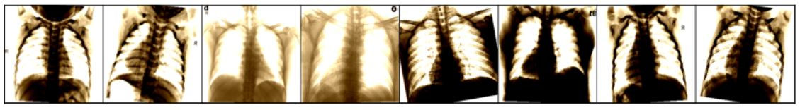

## COVID-19 Classifier With Transfer Learning


Corona or COVID-19 is a virus that affects human and other mammal’s respiratory system. There are more than 10 millions confirmed cases reported by [WHO](https://covid19.who.int/?gclid=Cj0KCQjwoub3BRC6ARIsABGhnyap-6khHl2aUfbxrKfFFOT2qkw3pCYK8ocAp9Ua4tmsJf4LVTgtKSIaAqQqEALw_wcB) at the time this article is created.

These viruses are actually closely associated with infections like pneumonia, lung inflammation, abscesses, or enlarged lymph nodes. As COVID-19 tests are hard to come by and insufficient to be provided to people all around the world, chest x-ray images are actually one of the important methods to identify the corona virus through imaging.

Hence, the objective of this article would be to create a COVID-19 classifier which will be trained with chest x-ray images and is able to classify them as either positive (COVID-19 infected) or negative (Normal). 

`Note: I am not a medical expert and there are definitely more reliable ways of detecting COVID-19. The main purpose of this article is to walk through the steps to create a classifier with PyTorch by using transfer learning and at the same time exploring how we could apply deep learning knowledge to the medical field.`

Okay. Enough for the intro, let's start!

A few notes before we get started:
1. For simplicity, we will be writing our code and do our training on [Kaggle](https://www.kaggle.com/), utilizing the free GPU provided.
2. [PyTorch](https://pytorch.org/) will be the Deep Learning framework used.
3. There will only be function call throughout this article to avoid cluttering the page. 
The complete code will be available at [Jovian](https://jovian.ml/enjoy-kcc/covid-19-classifier). 
Please note that you will need to sign in to run the code.

Throughout this article, we will step through the following sections to finally get our COVID-19 classifier!
1. Data Analysis
2. Image Data Exploring
3. Data Augmentation
4. Data Loaders
5. Training With Transfer Learning
6. Evaluation With Graph Plotting


### 1. Data Analysis
The data that we are going to use to train our classifier will be the [CoronaHack-Chest X-Ray-Dataset](https://www.kaggle.com/praveengovi/coronahack-chest-xraydataset) which is available in Kaggle. We will be exploring and analyzing the data to determine the right data to use for the training. 


First, import all the necessary libraries.
```markdown
import os
import numpy as np
import pandas as pd
import seaborn as sns
from PIL import Image
import matplotlib.pyplot as plt
from tqdm.notebook import tqdm
from sklearn.metrics import f1_score
from sklearn.utils import shuffle

import torch
import torch.nn as nn
import torch.nn.functional as F
from torch.utils.data import Dataset, DataLoader, random_split

import torchvision.models as models
import torchvision.transforms as transforms
from torchvision.utils import make_grid
from torchvision.datasets import ImageFolder
%matplotlib inline
```


`Please noted that after the notebook is run in Kaggle, click 'Add data' at the top right, search for the dataset 'CoronaHack-Chest X-Ray-Dataset' and add in into the notebook.
Other than that, one could also start a new notebook with the dataset.`


Defined the constants to access the data and csv files. 
```markdown
DATA_DIR = '../input/coronahack-chest-xraydataset/Coronahack-Chest-XRay-Dataset/Coronahack-Chest-XRay-Dataset'

TRAIN_DIR = os.path.join(DATA_DIR, 'train')
TEST_DIR = os.path.join(DATA_DIR, 'test')

METADATA_CSV = '../input/coronahack-chest-xraydataset/Chest_xray_Corona_Metadata.csv'
```


Read the csv file using pandas and show 10 samples.
```markdown
metadata_df = pd.read_csv(METADATA_CSV)
metadata_df.sample(10)
```


Get the size of the original train and test dataset.
```markdown
train_data = metadata_df[metadata_df['Dataset_type'] == 'TRAIN']
test_data = metadata_df[metadata_df['Dataset_type'] == 'TEST']

print(f'Shape of train set: {train_data.shape}')
print(f'Shape of test set: {test_data.shape}')
```


Get the amount of null values in each attribute. With this we know that out of 5286 images in the train set, 5217 images actually have null value in attribute 'Label_2_Virus_category' and 1342 images are having null value in attribute 'Label_1_Virus_category'.
```markdown
train_null_vals = train_data.isnull().sum()
test_null_vals = test_data.isnull().sum()
print(f'The number of null values in train set: \n{train_null_vals}\n')
print(f'The number of null values in test set: \n{test_null_vals}')
train_null_vals.plot(kind='bar')
```


We subtitue null value with 'unknown' and plot the graphs to better identify the distribution.
```markdown
targets = ['Label', 'Label_1_Virus_category', 'Label_2_Virus_category']
fig, ax = plt.subplots(1, 3, figsize=(20, 4))
sns.countplot(x=targets[0], data=filled_train_data, ax=ax[0])
sns.countplot(x=targets[1], data=filled_train_data, ax=ax[1])
sns.countplot(x=targets[2], data=filled_train_data, ax=ax[2])
plt.show()
```


```markdown
fig, ax = plt.subplots(1, 3, figsize=(20, 4))
sns.countplot(x=targets[0], data=train_data, ax=ax[0])
sns.countplot(x=targets[1], data=train_data, ax=ax[1])
sns.countplot(x=targets[2], data=train_data, ax=ax[2])
plt.show()
```


```markdown
normal_cases = train_data[train_data['Label'] == 'Normal'].shape[0]
pnemonia_covid_cases = train_data[(train_data['Label'] == 'Pnemonia') & (train_data['Label_2_Virus_category'] == 'COVID-19')].shape[0]
normal_covid_cases = train_data[(train_data['Label'] == 'Normal') & (train_data['Label_2_Virus_category'] == 'COVID-19')].shape[0]

label_2_unknown_cases = filled_train_data[filled_train_data['Label_2_Virus_category'] == 'unknown'].shape[0]
label_2_covid_cases = filled_train_data[filled_train_data['Label_2_Virus_category'] == 'COVID-19'].shape[0]

print(f'Normal cases: {normal_cases}')
print(f'Cases where pnemonia + COVID-19 in Label_2_Virus_category: {pnemonia_covid_cases}')
print(f'Cases where normal + COVID-19 in Label_2_Virus_category: {normal_covid_cases}')
print(f'Percentage of unknown value and COVID-19 value in total cases: {(label_2_unknown_cases/filled_train_data.shape[0])*100:.2f}% | {(label_2_covid_cases/filled_train_data.shape[0])*100:.2f}%')
```


From the graphs plotted, we can actually observe that:
1. All COVID-19 cases are labeled with Pnemonia and none is labeled as normal.
2. Under attribute of 'Label_2_Virus_category', 98.69% of entries is unknown and only 1.10% is categorized as COVID-19.
3. The remaining 0.2% are categorized as ARDS, SARS and Streptococcus.

Hence, the model is going to be created with the training data compose of 'Normal' and 'Pnemonia + COVID-19' images and finally able to classify them accordingly.


### Image Data Exploring
Here, we do the preparation of data for training by getting on those are labeled as 'Normal' or 'Pnemonia + COVID-19'. Based on previous analysis, we know that there are only 58 images labeled as 'Pnemonia + COVID-19'. Hence, we will be taking almost equivalent amount of 'Normal' image to avoid data imbalance. Lastly, we create a new attribute 'target' to categorize 'Normal' as negative and 'Pnemonia + COVID-19' as positive.
```markdown
# get the final train data with only entries labeled as 'Normal' or 'Pnemonia + COVID-19'
normal_train_data = train_data[(train_data['Label'] == 'Normal')]
pnemonia_covid_train_data = train_data[((train_data['Label'] == 'Pnemonia') & (train_data['Label_2_Virus_category'] == 'COVID-19'))]
print(f'Dataset size for "Pnemonia + COVID-19": {len(pnemonia_covid_train_data)}')

# shuffle the data with 'Normal'
normal_train_data = shuffle(normal_train_data, random_state=1)

# get only 1/22 portion of the total 'Normal' data to reduce data imbalance between both classes
normal_train_data = normal_train_data.sample(frac=(1/22))
print(f'Dataset size for "Normal": {len(normal_train_data)}')

# create the final train data with all 'Pnemonia + COVID-19' entries and portion of 'Normal' entries 
final_train_data = pd.concat([normal_train_data, pnemonia_covid_train_data], axis=0)

# create target attribute to categorize 'Normal' as negative and 'Pnemonia + COVID-19' as positive
targets = {0: "negative", 1: "positive"}
final_train_data['target'] = [0 if label == 'Normal' else 1 for label in final_train_data['Label']]
print(f'Final size of the dataset: {len(final_train_data)}')
```


Let's look at some sample of the images.
```markdown
# show sample of 'Normal'
show_sample(*dataset[1166], invert=False)
```


```markdown
# show sample of 'Pnemonia + COVID-19'
show_sample(*dataset[5262], invert=False)
```


### Data Augmentation
As the amount of data available for use is actually quite few, we will need to do some data augmentation. This method is useful when we have little amount of data, as it allows us to increase the variety of the images being passed to model for training. We will do some resize to ensure every images have the same size, do some random horizontal flip, random rotation etc.
```mardown
imagenet_stats = ([0.485, 0.456, 0.406], [0.229, 0.224, 0.225])

train_tfms = transforms.Compose([
    transforms.Resize((256, 256)), 
    transforms.RandomHorizontalFlip(), 
    transforms.RandomRotation(10),
    transforms.ToTensor(), 
#     transforms.RandomErasing(inplace=True),
    transforms.Normalize(*imagenet_stats, inplace=True),
])

valid_tfms = transforms.Compose([
    transforms.Resize((256, 256)), 
    transforms.ToTensor(), 
    transforms.Normalize(*imagenet_stats),
])
```

Then, we will split the train and test set with ratio of 9:1.
```markdown
np.random.seed(42)
msk = np.random.rand(len(final_train_data)) < 0.9

train_df = final_train_data[msk].reset_index()
val_df = final_train_data[~msk].reset_index()
```


### Data Loaders
Here, we create the data loaders for our train and test size with a batch size of 8. 
```markdown
batch_size = 8
train_dataset = COVID19Dataset(train_df, TRAIN_DIR, transform=train_tfms)
val_dataset = COVID19Dataset(val_df, TRAIN_DIR, transform=valid_tfms)
```
```markdown
train_data_loader = DataLoader(train_dataset, batch_size, shuffle=True, num_workers=3, pin_memory=True)
val_data_loader = DataLoader(val_dataset, batch_size, num_workers=2, pin_memory=True)
```
```markdown
show_batch(train_data_loader, invert=True)
```



### Training With Transfer Learning
Here, we define our COVIDResnet model class inherited from the ImageClassificationBase. We load the pre-trained resnet50 model from torchvision, retain its feature extraction layers and replace the top layer (which normally is the layer for classification) with our own layer of 2 classes (positive and negative).
```markdown
class COVIDResnet(ImageClassificationBase):
    def __init__(self):
        super().__init__()
        # Use a pretrained model
        self.network = models.resnet50(pretrained=True)
        # Replace last layer
        num_ftrs = self.network.fc.in_features
        self.network.fc = nn.Linear(num_ftrs, 2)
    
    def forward(self, xb):
        return torch.softmax(self.network(xb), dim=1)
    
    def freeze(self):
        # To freeze the residual layers
        for param in self.network.parameters():
            param.require_grad = False
        for param in self.network.fc.parameters():
            param.require_grad = True
    
    def unfreeze(self):
        # Unfreeze all layers
        for param in self.network.parameters():
            param.require_grad = True
```


Next, we will check the type device we are running and use GPU if it is available.
```markdown
device = get_default_device()
device
```


After that, load the data loader into the device.
```markdown
train_data_loader = DeviceDataLoader(train_data_loader, device)
val_data_loader = DeviceDataLoader(val_data_loader, device)
```

Load the model into GPU device.
```markdown
model = to_device(COVIDResnet(), device)
```

Get the validation result before we start the training.
```markdown
history = [evaluate(model, val_data_loader)]
history
```


Freeze the initial feature extraction layers and only train the top layer.
```markdown
model.freeze()
```

Define the hyperparameters.
```markdown
epochs = 5
max_lr = 0.01
grad_clip = 0.1
weight_decay = 1e-4
opt_func = torch.optim.Adam
```

Start our training!
```markdown
%%time
history += fit_one_cycle(epochs, max_lr, model, train_data_loader, val_data_loader, 
                         grad_clip=grad_clip, 
                         weight_decay=weight_decay, 
                         opt_func=opt_func)
```


_HBox(children=(FloatProgress(value=0.0, max=14.0), HTML(value='')))_

_Epoch [0], last_lr: 0.0074, train_loss: 0.4979, train_acc: 0.8304, val_loss: 0.8133, val_acc: 0.5000_
_HBox(children=(FloatProgress(value=0.0, max=14.0), HTML(value='')))_

_Epoch [1], last_lr: 0.0095, train_loss: 0.4582, train_acc: 0.8393, val_loss: 0.8758, val_acc: 0.4375_
_HBox(children=(FloatProgress(value=0.0, max=14.0), HTML(value='')))_

_Epoch [2], last_lr: 0.0061, train_loss: 0.6244, train_acc: 0.6696, val_loss: 0.8265, val_acc: 0.5208_
_HBox(children=(FloatProgress(value=0.0, max=14.0), HTML(value='')))_

_Epoch [3], last_lr: 0.0019, train_loss: 0.5569, train_acc: 0.7500, val_loss: 0.3767, val_acc: 0.9375_
_HBox(children=(FloatProgress(value=0.0, max=14.0), HTML(value='')))_

_Epoch [4], last_lr: 0.0000, train_loss: 0.5239, train_acc: 0.7857, val_loss: 0.3755, val_acc: 0.9375_
_CPU times: user 5.48 s, sys: 1.14 s, total: 6.62 s_
_Wall time: 42.4 s_


We unfreeze and train all the layers.
```markdown
model.unfreeze()
```

```markdown
%%time
history += fit_one_cycle(epochs, 0.001, model, train_data_loader, val_data_loader,
                         grad_clip=grad_clip, 
                         weight_decay=weight_decay, 
                         opt_func=opt_func)
```


_HBox(children=(FloatProgress(value=0.0, max=14.0), HTML(value='')))_

_Epoch [0], last_lr: 0.0007, train_loss: 0.4891, train_acc: 0.8125, val_loss: 0.3133, val_acc: 1.0000_
_HBox(children=(FloatProgress(value=0.0, max=14.0), HTML(value='')))_

_Epoch [1], last_lr: 0.0010, train_loss: 0.4484, train_acc: 0.8661, val_loss: 0.3175, val_acc: 1.0000_
_HBox(children=(FloatProgress(value=0.0, max=14.0), HTML(value='')))_

_Epoch [2], last_lr: 0.0006, train_loss: 0.3864, train_acc: 0.9196, val_loss: 0.3133, val_acc: 1.0000_
_HBox(children=(FloatProgress(value=0.0, max=14.0), HTML(value='')))_

_Epoch [3], last_lr: 0.0002, train_loss: 0.3595, train_acc: 0.9554, val_loss: 0.3133, val_acc: 1.0000_
_HBox(children=(FloatProgress(value=0.0, max=14.0), HTML(value='')))_

_Epoch [4], last_lr: 0.0000, train_loss: 0.3612, train_acc: 0.9464, val_loss: 0.3144, val_acc: 1.0000_
_CPU times: user 5.57 s, sys: 1.1 s, total: 6.67 s_
_Wall time: 42.5 s_


### Evaluation With Graph Plotting
Let's visualize the data in graphs.
```markdown
plot_losses(history)
```


```markdown
plot_accuracies(history)
```


As the number of 'Pnemonia + COVID-19' is limited and 0 in test set. We will be evaluating with validation set instead.
```markdown
pnemonia_covid_cases_test = test_data[(test_data['Label'] == 'Pnemonia') & (test_data['Label_2_Virus_category'] == 'COVID-19')].shape[0]
print(f'Number of "Pnemonia + COVID-19" in test data: {pnemonia_covid_cases_test}')
```


```markdown
test_data_loader = DataLoader(val_dataset, batch_size, num_workers=3, pin_memory=True)
test_data_loader = DeviceDataLoader(test_data_loader, device)

test_acc = predict_dl(test_data_loader, model)
print(f'Accuracy: {test_acc:.2f}%')
```


Show some prediction samples
```markdown
images, labels = next(iter(val_data_loader))
predict_and_plot(images, labels)
```


You can use the [editor on GitHub](https://github.com/enjoykcc456/covid-19/edit/master/README.md) to maintain and preview the content for your website in Markdown files.

Whenever you commit to this repository, GitHub Pages will run [Jekyll](https://jekyllrb.com/) to rebuild the pages in your site, from the content in your Markdown files.

### Markdown

Markdown is a lightweight and easy-to-use syntax for styling your writing. It includes conventions for

```markdown
Syntax highlighted code block

# Header 1
## Header 2
### Header 3

- Bulleted
- List

1. Numbered
2. List

**Bold** and _Italic_ and `Code` text

[Link](url) and 
```


For more details see [GitHub Flavored Markdown](https://guides.github.com/features/mastering-markdown/).

### Jekyll Themes

Your Pages site will use the layout and styles from the Jekyll theme you have selected in your [repository settings](https://github.com/enjoykcc456/covid-19/settings). The name of this theme is saved in the Jekyll `_config.yml` configuration file.

### Support or Contact

Having trouble with Pages? Check out our [documentation](https://help.github.com/categories/github-pages-basics/) or [contact support](https://github.com/contact) and we’ll help you sort it out.
